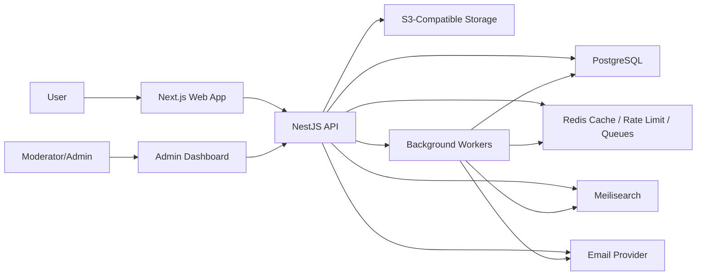

# LowKeyBD Phase 1 Blueprint

## Executive Summary

LowKeyBD is Bangladesh's digital knowledge platform: a trusted place to search, ask, discuss, recommend, review, and discover useful local information.

The MVP should not try to ship every long-term feature. It should establish the core behavior users will return for:

- Find trusted Bangladesh-specific information quickly.
- Ask for help from relevant communities.
- Share local knowledge through posts, comments, and answers.
- Build reputation around helpful contributions.
- Support moderation, safety, and search from day one.

The recommended Phase 1 product is a modular monolith using Next.js, NestJS, PostgreSQL, Prisma, Redis, Meilisearch, and Docker. This gives the team speed without painting the company into a corner. The codebase should be organized by business capability so individual modules can later become services if scale or team ownership demands it.

## Product North Star

Every feature should answer:

> Does this help someone in Bangladesh make a better decision?

If not, it should be deferred.

## MVP Scope

### Build Now

- Authentication with email/password, JWT access tokens, refresh tokens, and email verification.
- User profiles with reputation, contribution history, and basic privacy controls.
- Communities for topics, cities, universities, professions, local areas, and interests.
- Posts supporting discussion, questions, guides, recommendations, warnings, and reviews-lite.
- Comments with nested replies limited to one or two levels for usability.
- Voting and reaction signals for ranking useful content.
- Search across communities, posts, comments, and users.
- Notifications for replies, mentions, moderation decisions, and community activity.
- Admin and moderation dashboard.
- Reporting, audit logs, rate limiting, and basic anti-spam controls.
- Light mode, dark mode, responsive design, accessibility, command palette.

### Prepare Now, Ship Later

The architecture should contain clear future module boundaries for:

- Business profiles
- Places
- Deals
- Marketplace
- University spaces
- Verification
- Messaging
- AI search
- Recommendation engine
- Wiki knowledge pages
- Subscription sharing
- Travel/shopping/event partners

These should not be implemented in MVP except where a placeholder boundary helps prevent future rewrites.

### Do Not Build Yet

- Full private messaging
- Marketplace transactions
- Paid subscriptions
- National ID verification
- Semantic AI search
- Business owner dashboards
- Native mobile apps
- Complex gamification
- Multi-region infrastructure

## Architecture Principles

### Recommended Shape

Use a modular monolith.

This is the right starting point because LowKeyBD needs fast product iteration, strong consistency, simple deployment, and clean domain boundaries. Microservices too early would slow down a small founding team. A traditional unstructured monolith would become painful as the platform expands.

### Core Architecture Rules

- Organize code by feature/domain, not by technical layer alone.
- Keep business rules inside domain/application services.
- Keep controllers thin.
- Use repositories to isolate database access.
- Use DTOs and validation for every API boundary.
- Use domain events for cross-module side effects.
- Use background workers for slow or retryable tasks.
- Keep modules independently extractable.
- Avoid direct cross-module database writes.
- Version public APIs from the beginning.

## System Context



## Application Modules

### Identity Module

Responsibilities:

- Registration
- Login
- Refresh token rotation
- Password reset
- Email verification
- Session management
- Account status
- Basic device/session audit trail

Key entities:

- User
- AccountCredential
- RefreshToken
- EmailVerificationToken
- PasswordResetToken
- UserSession

### Profile Module

Responsibilities:

- Public profile
- Username and display name
- Bio, avatar, location
- Reputation summary
- Contribution stats
- Privacy flags

Key entities:

- Profile
- UserReputation
- UserBadge

### Community Module

Responsibilities:

- Community creation
- Community discovery
- Community membership
- Roles inside communities
- Community rules
- Community moderation settings

Key entities:

- Community
- CommunityMember
- CommunityRule
- CommunityTopic

### Content Module

Responsibilities:

- Posts
- Comments
- Mentions
- Slugs
- Content status
- Soft deletion
- Content ranking metadata

Key entities:

- Post
- Comment
- PostTag
- ContentMention

Recommended post types:

- question
- discussion
- recommendation
- guide
- review
- warning
- news_discussion

### Voting Module

Responsibilities:

- Upvotes and downvotes
- Helpful votes
- Abuse-resistant vote tracking
- Vote aggregate updates

Key entities:

- Vote
- VoteAggregate

### Search Module

Responsibilities:

- Indexing searchable objects
- Search query API
- Facets and filters
- Search analytics
- Future semantic search interface

Searchable MVP types:

- Community
- Post
- Comment
- User profile

Future searchable types:

- Business
- Place
- Deal
- Guide
- WikiPage
- Review

### Notification Module

Responsibilities:

- In-app notifications
- Email notification hooks
- Notification preferences
- Read/unread state

Key entities:

- Notification
- NotificationPreference

### Moderation Module

Responsibilities:

- Reports
- Content review queue
- User warnings
- Temporary restrictions
- Bans
- Moderator notes
- Automated spam signals

Key entities:

- Report
- ModerationAction
- UserRestriction
- ModeratorNote

### Admin Module

Responsibilities:

- Admin dashboard
- User management
- Community management
- Reports queue
- Audit log viewer
- Feature flag management

### Audit Module

Responsibilities:

- Security-sensitive event logs
- Admin/moderator actions
- Authentication events
- Permission changes

Key entities:

- AuditLog

### Platform Module

Responsibilities:

- Feature flags
- App settings
- Health checks
- Operational metadata

## Recommended Repository Structure

```text
lowkeybd/
  apps/
    web/
      src/
        app/
        components/
        features/
        lib/
        stores/
        styles/
        tests/
    api/
      src/
        main.ts
        app.module.ts
        modules/
          identity/
          profiles/
          communities/
          content/
          voting/
          search/
          notifications/
          moderation/
          admin/
          audit/
          platform/
        common/
          auth/
          config/
          database/
          decorators/
          errors/
          events/
          filters/
          guards/
          interceptors/
          logging/
          pagination/
          queues/
          validation/
        workers/
  packages/
    config/
    database/
      prisma/
        schema.prisma
        migrations/
        seed.ts
    eslint-config/
    tsconfig/
    ui/
      components/
      tokens/
    types/
  infra/
    docker/
    nginx/
    scripts/
  docs/
    architecture/
    api/
    product/
  .github/
    workflows/
  docker-compose.yml
  package.json
  pnpm-workspace.yaml
```

## Backend Layering

Each API module should follow this pattern:

```text
modules/content/
  domain/
    entities/
    policies/
    events/
  application/
    commands/
    queries/
    services/
  infrastructure/
    repositories/
    search/
    queue-handlers/
  presentation/
    controllers/
    dto/
  content.module.ts
```

### Domain Layer

Contains business concepts and rules.

Examples:

- A deleted post cannot receive new comments.
- A banned user cannot create posts.
- A post in a restricted community requires membership.

### Application Layer

Coordinates use cases.

Examples:

- CreatePostService
- JoinCommunityService
- ReportContentService
- SearchContentService

### Infrastructure Layer

Handles external systems.

Examples:

- Prisma repositories
- Meilisearch indexers
- Redis queues
- S3 uploads

### Presentation Layer

Handles HTTP and WebSocket boundaries.

Examples:

- REST controllers
- DTOs
- Input validation
- Response mapping

## Database Design

### General Rules

- Use UUID primary keys.
- Use `createdAt`, `updatedAt`, `deletedAt` on core tables.
- Use soft deletion for user-generated content.
- Use cursor pagination for feeds and search results.
- Use indexes for foreign keys, slugs, status fields, and sorting fields.
- Keep denormalized counters only when performance requires them.
- Maintain aggregates through transactions or background reconciliation.
- Avoid storing duplicated source-of-truth data.

### Core Tables

#### users

- id UUID primary key
- email unique nullable until verified policy is finalized
- username unique
- displayName
- role
- status
- emailVerifiedAt
- createdAt
- updatedAt
- deletedAt

Indexes:

- unique email
- unique username
- status
- createdAt

#### user_credentials

- id UUID primary key
- userId foreign key
- passwordHash
- passwordChangedAt
- createdAt
- updatedAt

#### refresh_tokens

- id UUID primary key
- userId foreign key
- tokenHash
- familyId
- revokedAt
- expiresAt
- createdAt

Indexes:

- userId
- tokenHash
- familyId
- expiresAt

#### profiles

- id UUID primary key
- userId unique foreign key
- bio
- avatarUrl
- locationText
- reputationScore
- contributionCount
- createdAt
- updatedAt

#### communities

- id UUID primary key
- slug unique
- name
- description
- type
- visibility
- status
- ownerId foreign key
- memberCount
- postCount
- createdAt
- updatedAt
- deletedAt

Indexes:

- slug unique
- type
- visibility
- status
- memberCount

#### community_members

- id UUID primary key
- communityId foreign key
- userId foreign key
- role
- status
- joinedAt
- createdAt
- updatedAt

Indexes:

- unique communityId, userId
- communityId, role
- userId, status

#### posts

- id UUID primary key
- communityId foreign key
- authorId foreign key
- type
- title
- slug
- body
- status
- score
- commentCount
- viewCount
- publishedAt
- createdAt
- updatedAt
- deletedAt

Indexes:

- communityId, createdAt
- authorId, createdAt
- type, status
- score, createdAt
- publishedAt
- unique communityId, slug

#### comments

- id UUID primary key
- postId foreign key
- authorId foreign key
- parentId nullable self-reference
- body
- status
- score
- replyCount
- createdAt
- updatedAt
- deletedAt

Indexes:

- postId, createdAt
- parentId, createdAt
- authorId, createdAt
- status

#### votes

- id UUID primary key
- userId foreign key
- targetType
- targetId
- value
- createdAt
- updatedAt

Indexes:

- unique userId, targetType, targetId
- targetType, targetId

#### notifications

- id UUID primary key
- userId foreign key
- actorId nullable foreign key
- type
- title
- body
- entityType
- entityId
- readAt
- createdAt

Indexes:

- userId, readAt, createdAt
- entityType, entityId

#### reports

- id UUID primary key
- reporterId foreign key
- targetType
- targetId
- reason
- details
- status
- assignedToId nullable foreign key
- createdAt
- updatedAt

Indexes:

- status, createdAt
- targetType, targetId
- reporterId

#### moderation_actions

- id UUID primary key
- moderatorId foreign key
- targetUserId nullable foreign key
- targetType
- targetId
- actionType
- reason
- metadata JSONB
- createdAt

#### audit_logs

- id UUID primary key
- actorId nullable foreign key
- action
- entityType
- entityId
- ipAddress
- userAgent
- metadata JSONB
- createdAt

Indexes:

- actorId, createdAt
- entityType, entityId
- action, createdAt

#### feature_flags

- id UUID primary key
- key unique
- description
- enabled
- rolloutPercentage
- rules JSONB
- createdAt
- updatedAt

## Search Design

### MVP Search

Use Meilisearch for fast keyword search with typo tolerance and filtering.

Indexes:

- communities
- posts
- comments
- users

Unified search endpoint:

```text
GET /api/v1/search?q=visa+agent&types=posts,communities&communityId=&cursor=
```

Search result shape:

```json
{
  "items": [
    {
      "id": "uuid",
      "type": "post",
      "title": "Best way to apply for Thailand visa from Dhaka?",
      "excerpt": "Recent experience from Gulshan VFS...",
      "url": "/c/travel-bangladesh/posts/slug",
      "score": 124,
      "createdAt": "2026-07-06T00:00:00.000Z"
    }
  ],
  "nextCursor": null
}
```

### Future AI Search

Design the Search module with an interface that can later support:

- embeddings
- semantic retrieval
- hybrid ranking
- answer summaries
- citation-backed AI responses
- personalized recommendations

Do not couple business logic directly to Meilisearch. The application should call a SearchService interface, with Meilisearch as the first implementation.

## API Design

### API Standards

- Prefix all endpoints with `/api/v1`.
- Use REST for MVP.
- Use WebSockets only for realtime notifications initially.
- Validate every request body.
- Return consistent error envelopes.
- Use cursor pagination for large lists.
- Support request IDs.
- Include rate limit headers.

### Response Envelope

```json
{
  "data": {},
  "meta": {
    "requestId": "req_123"
  }
}
```

### Error Envelope

```json
{
  "error": {
    "code": "VALIDATION_ERROR",
    "message": "Please check the highlighted fields.",
    "details": []
  },
  "meta": {
    "requestId": "req_123"
  }
}
```

### Key MVP Endpoints

Identity:

- `POST /api/v1/auth/register`
- `POST /api/v1/auth/login`
- `POST /api/v1/auth/refresh`
- `POST /api/v1/auth/logout`
- `POST /api/v1/auth/verify-email`
- `POST /api/v1/auth/request-password-reset`
- `POST /api/v1/auth/reset-password`
- `GET /api/v1/auth/me`

Profiles:

- `GET /api/v1/users/:username`
- `PATCH /api/v1/me/profile`
- `GET /api/v1/me/activity`

Communities:

- `GET /api/v1/communities`
- `POST /api/v1/communities`
- `GET /api/v1/communities/:slug`
- `PATCH /api/v1/communities/:slug`
- `POST /api/v1/communities/:slug/join`
- `POST /api/v1/communities/:slug/leave`
- `GET /api/v1/communities/:slug/posts`

Posts:

- `POST /api/v1/posts`
- `GET /api/v1/posts/:id`
- `PATCH /api/v1/posts/:id`
- `DELETE /api/v1/posts/:id`
- `POST /api/v1/posts/:id/vote`
- `GET /api/v1/posts/:id/comments`

Comments:

- `POST /api/v1/posts/:id/comments`
- `PATCH /api/v1/comments/:id`
- `DELETE /api/v1/comments/:id`
- `POST /api/v1/comments/:id/vote`

Search:

- `GET /api/v1/search`
- `GET /api/v1/search/suggestions`

Notifications:

- `GET /api/v1/notifications`
- `POST /api/v1/notifications/:id/read`
- `POST /api/v1/notifications/read-all`
- `PATCH /api/v1/me/notification-preferences`

Moderation:

- `POST /api/v1/reports`
- `GET /api/v1/admin/reports`
- `POST /api/v1/admin/reports/:id/resolve`
- `POST /api/v1/admin/moderation/actions`

Admin:

- `GET /api/v1/admin/overview`
- `GET /api/v1/admin/users`
- `PATCH /api/v1/admin/users/:id/status`
- `GET /api/v1/admin/audit-logs`
- `GET /api/v1/admin/feature-flags`
- `PATCH /api/v1/admin/feature-flags/:key`

## Event-Driven Design

Use domain events inside the monolith to decouple modules.

Initial events:

- UserRegistered
- EmailVerified
- CommunityCreated
- UserJoinedCommunity
- PostCreated
- PostUpdated
- PostDeleted
- CommentCreated
- CommentDeleted
- VoteCast
- ContentReported
- ModerationActionCreated

Event consumers:

- Search indexing
- Notification creation
- Reputation updates
- Audit logging
- Spam scoring
- Email delivery

For MVP, events can be handled through NestJS event emitters and Redis-backed queues. Later, this can move to Kafka, RabbitMQ, or a managed event bus.

## Security Architecture

### Authentication

- Use short-lived JWT access tokens.
- Use refresh token rotation.
- Store refresh tokens hashed in the database.
- Revoke token families when reuse is detected.
- Require email verification before high-trust actions.

### Authorization

Use RBAC with permission checks.

Global roles:

- user
- trusted_user
- moderator
- admin
- super_admin

Community roles:

- member
- contributor
- community_moderator
- community_admin
- owner

Permission examples:

- `post:create`
- `post:delete:any`
- `community:update:own`
- `report:review`
- `user:restrict`
- `admin:access`

### Abuse Protection

- Rate limit registration, login, posting, commenting, voting, and reporting.
- Track suspicious IP/user-agent patterns.
- Add spam signals to content creation.
- Require progressive trust for sensitive actions.
- Introduce CAPTCHA only when abuse signals require it.

### Web Security

- Validate and sanitize all input.
- Escape rendered content.
- Use HTTP-only secure cookies if web-only auth is chosen.
- Add CSRF protection if cookies are used for auth.
- Use strict CORS.
- Use security headers.
- Do not expose internal IDs unnecessarily in logs.
- Store secrets only in environment variables or a secret manager.

## Frontend Architecture

### Principles

- The first screen should be useful immediately.
- Search should be central.
- Community browsing should be obvious.
- Posting should feel low-friction.
- Reading should be comfortable on mobile.
- Accessibility should be treated as product quality, not compliance paperwork.

### Web App Structure

```text
apps/web/src/
  app/
    (public)/
    (auth)/
    (app)/
    admin/
  components/
    ui/
    layout/
    search/
    content/
    community/
    moderation/
  features/
    auth/
    profiles/
    communities/
    posts/
    comments/
    search/
    notifications/
    admin/
  lib/
    api/
    auth/
    query/
    accessibility/
    analytics/
  stores/
  styles/
```

### Design System

Foundational tokens:

- Color
- Typography
- Spacing
- Radius
- Shadows
- Motion
- Z-index
- Breakpoints

Recommended visual direction:

- Clean white or near-white light mode.
- Deep neutral dark mode, not pure black.
- One strong brand color used sparingly.
- Generous readability spacing.
- Rounded cards with restraint.
- Soft borders before heavy shadows.
- Strong focus states.
- Clear empty states with useful actions.

### Initial UI Components

Core:

- Button
- IconButton
- Input
- Textarea
- Select
- Checkbox
- Switch
- Badge
- Avatar
- Tooltip
- DropdownMenu
- Dialog
- Sheet
- Tabs
- Toast
- Skeleton
- EmptyState
- PaginationCursor

Product:

- AppShell
- TopNav
- SidebarNav
- SearchBar
- CommandPalette
- CommunityCard
- PostCard
- CommentThread
- VoteControl
- Composer
- NotificationBell
- UserMenu
- ReportDialog
- ModerationQueueItem
- AdminMetricCard

### Key Screens

Public:

- Home/search landing
- Community directory
- Community detail
- Post detail
- User profile
- Login
- Register

Authenticated:

- Personalized feed
- Create post
- Edit profile
- Notifications
- Joined communities
- Settings

Admin/moderation:

- Overview
- Reports queue
- Content review
- User management
- Audit logs
- Feature flags

## UX Recommendations

### Home Screen

The home screen should not feel like a marketing page. It should be a usable search and discovery surface.

Primary elements:

- Large search input: "Search anything Bangladesh..."
- Trending questions
- Popular communities
- Recent helpful posts
- Clear "Ask" action

### Content Model UX

Use simple content labels:

- Ask
- Discuss
- Recommend
- Review
- Guide
- Warn

Avoid jargon like "thread type" in the interface.

### Accessibility Requirements

- Keyboard accessible command palette.
- Visible focus rings.
- Proper heading order.
- Color contrast at WCAG AA or better.
- ARIA labels for icon-only controls.
- Large touch targets.
- Reduced motion support.
- Form errors tied to fields.
- Screen reader friendly notification updates.

## Infrastructure

### Local Development

Docker Compose services:

- web
- api
- postgres
- redis
- meilisearch
- mailpit
- minio

### Production Baseline

Start with:

- Managed PostgreSQL
- Managed Redis if budget allows
- S3-compatible object storage
- Containerized API and web app
- Meilisearch managed or self-hosted with snapshots
- CDN for static assets
- Centralized logging
- Error tracking

### CI/CD

GitHub Actions workflow:

- install
- lint
- typecheck
- unit tests
- build
- prisma migration check
- docker build
- deploy staging
- deploy production with approval

### Observability

Track:

- API latency
- error rate
- database query latency
- slow queries
- search latency
- queue depth
- failed jobs
- login failures
- post creation rate
- report volume
- moderation resolution time

## Testing Strategy

MVP test coverage should focus on trust boundaries and core behavior.

Backend:

- Unit tests for domain policies.
- Integration tests for repositories and services.
- E2E tests for auth, posting, commenting, voting, reporting.
- Permission tests for admin and moderation routes.

Frontend:

- Component tests for core UI.
- Integration tests for auth and content flows.
- Accessibility checks for key screens.
- Playwright smoke tests for critical journeys.

Critical user journeys:

- Register and verify email.
- Log in and refresh session.
- Create community.
- Join community.
- Create post.
- Comment on post.
- Vote on content.
- Search for content.
- Report content.
- Moderator resolves report.

## MVP Roadmap

### Milestone 0: Foundation

- Monorepo setup
- Next.js app shell
- NestJS API shell
- Shared TypeScript config
- Tailwind and shadcn/ui setup
- Prisma setup
- Docker Compose
- Environment validation
- Logging and request IDs

### Milestone 1: Identity and Profiles

- Registration
- Login
- Refresh token rotation
- Email verification
- Profile creation
- Profile editing
- Authenticated app shell

### Milestone 2: Communities

- Community model
- Community list and detail
- Join/leave
- Community roles
- Community rules
- Community feed shell

### Milestone 3: Content

- Create post
- Post detail
- Edit/delete own post
- Comments
- Basic feed ranking
- Soft deletion

### Milestone 4: Voting and Reputation

- Vote on posts
- Vote on comments
- Score aggregates
- Basic reputation updates
- Abuse-resistant vote constraints

### Milestone 5: Search

- Meilisearch setup
- Index communities and posts
- Search API
- Search UI
- Suggestions
- Reindex worker

### Milestone 6: Notifications

- In-app notifications
- Notification preferences
- Read/unread state
- Realtime notification channel

### Milestone 7: Moderation and Admin

- Report content
- Moderation queue
- Moderator actions
- User restrictions
- Audit logs
- Admin overview

### Milestone 8: Polish and Launch Readiness

- Dark mode
- Command palette
- Accessibility pass
- Performance pass
- Security review
- Seed data
- Staging deployment
- Production deployment checklist

## Product Metrics

Activation:

- Registration completion rate
- Email verification rate
- First search rate
- First post/comment rate
- First community join rate

Engagement:

- Daily active users
- Weekly active users
- Searches per user
- Posts per user
- Comments per post
- Return rate by cohort

Trust and quality:

- Helpful vote ratio
- Report rate
- Moderation response time
- Search zero-result rate
- Spam removal rate
- Verified email percentage

Growth:

- Community creation rate
- Invite/share rate
- Organic search traffic
- Top landing content pages

## Key Architectural Decisions

### Modular Monolith First

This gives speed, consistency, and lower operational cost while keeping service boundaries clean for later extraction.

### PostgreSQL as Source of Truth

PostgreSQL is reliable, mature, cost-effective, and flexible enough for relational data, JSONB metadata, indexing, and future scale strategies.

### Meilisearch for MVP Search

Meilisearch gives excellent user-facing search quickly. The Search module should hide the implementation so later AI search can be added without rewriting the product.

### Event-Driven Internal Workflows

Events keep posting, search indexing, notifications, reputation, and audit logs decoupled.

### Domain-Based Folder Structure

LowKeyBD's complexity will come from product domains, not technical layers. Domain-based structure keeps ownership clear.

### Admin and Moderation from Day One

Trust is a core product feature. Moderation cannot be bolted on after launch.

## Open Product Questions

These should be answered before implementation begins:

1. Should the MVP support Bangla UI, English UI, or both from launch?
2. Should authentication use email/password only, or include Google sign-in?
3. Should communities be user-created immediately, or admin-approved during beta?
4. Should downvotes exist from day one, or should MVP use helpful/unhelpful reactions?
5. Should anonymous posting exist in sensitive communities?
6. What is the initial moderation policy for political, religious, medical, legal, and financial advice?
7. Which Bangladesh regions, universities, and city communities should be seeded first?
8. Should public content be fully indexable by Google from launch?

## Recommended Phase 2 Implementation Order

If moving into code next, build in this order:

1. Monorepo, tooling, Docker, environment validation.
2. Database schema and Prisma migrations.
3. NestJS API foundation with auth, logging, validation, and errors.
4. Next.js foundation with design system, layout, and theme.
5. Identity and profiles.
6. Communities.
7. Posts and comments.
8. Voting and reputation.
9. Search.
10. Notifications.
11. Moderation and admin.
12. Launch hardening.

## Final Recommendation

LowKeyBD should start as a focused knowledge community product with search at its center, not as a broad social network. The MVP must prove that people can find and share useful Bangladesh-specific information better than they can through scattered Facebook groups, chats, and comment sections.

The architecture above supports that while leaving room for the larger vision: AI search, verified businesses, places, reviews, deals, marketplace features, and nationwide community trust.

